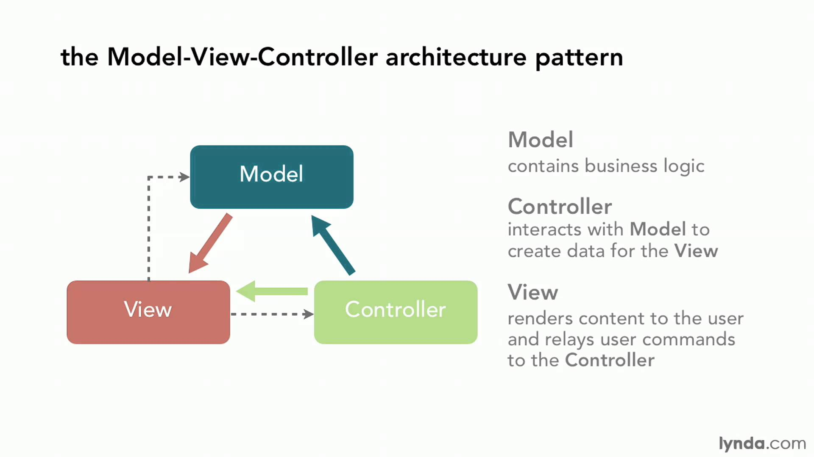

autoscale: true
theme: Next, 3

# Spring MVC
---

# Model View Controller (MVC)
- UI Architectural Pattern
- Separates controller from presentation (view)
- Separates business logic (model) from the controller
- 3 architectural components - Model, View and Controller

---

# Why MVC?
- Decoupled code (Separation of Concern)
- Clean code (Single Responsibility Principle)
- Better testability
- Little or no overlap in functionality across components
- Isolated changes help speed development

---

# Model
- Responsible for data and domain logic
- Independent of the UI
- Stores data and retrieves it based on commands in the controller

---

# View
- Visual representation of the model
- HTML/Javascript or JSON
- Generates new output based on changes in the model

---

# Controller
- Maps requests (Uri and HTTP Method) to functions that generate responses
- Accepts and validates inputs
- Converts input to commands for model and the views
- Can update the model's state

---

### MVC interaction


---

# History - Desktop applications
- First introduced as a pattern in the 70s
- Took off in the 90s
- Source: [MVC History](https://en.wikipedia.org/wiki/Model%E2%80%93view%E2%80%93controller#History)

---

# History - Web applications
- Java Servlets
  - Original Java web server component
  - Class implements HttpServlet interface
  - Configured into web.xml file
  - One servlet handles each URL path

---

# History - Servlet Problems
- Servlet Problems
  - Too much configuration
  - Not easily tested
  - Tightly coupled

---

# How does Spring help?
- Spring introduced Web Java MVC framework in early 2000s
 - [MVC History](https://en.wikipedia.org/wiki/Model%E2%80%93view%E2%80%93controller#History)
- Single servlet for all url paths
- Convention over configuration
- SpringBoot removes all configuration xml in favor of annotations!
- Allows developers to focus on "filling in the details" of the M,V and C

---

# Spring DispatcherServlet
- Single Servlet that routes all requests to Controllers
- Manages taking responses from Controllers and sends them to views

---

# Spring Web Support
- Spring MVC
- Spring Data REST
- Spring Web Services
- Spring Web Flows

---

# Installing Spring Boot Web
Add dependency to `build.gradle`

``` groovy
dependencies {
  ...
  compile('org.springframework.boot:spring-boot-starter-web')
  ...
}
```

# Spring Model
- Data Repositories (i.e. JPA Repository)
- domain logic (Service classes)

---

# Spring Controllers
- Handle incoming HTTP requests
- Process parameters (validate)
- Execute commands on the model

---

# Spring Controller basics
- Defined using `@Controller` above class
- Each method can respond to a different request
  - `@RequestMapping` above each method
- Url path elements and parameters can be mapped to arguments
  - `@PathVariable`
- @ResponseBody can be defined to get back an object instead of a view

---

# Request Mappings
- Specify path (including variables)
  - Base path for all requests may be set at class level with `@Controller`
- Optionally specify method
  - RequestMethod.GET|POST|PUT|DELETE

---

# Request Mappings - Composed
-  Allow for simpler specifications
- `@GetMapping(path)`
- `@PostMapping(path)`
- `@PutMapping(path)`
- `@DeleteMapping(path)`

---

# Request Mappings - URI Template Patterns
- Define patterns for URI mappings
- Define variables to be used as parameters
  - `@GetMapping('/owners/{ownerId}')`

---

# Request Mappings - Regular Expression Patterns
- very flexible
- harder to test permutations
``` groovy
@RequestMapping("/spring-web/{symbolicName:[a-z-]+}-{version:\\d\\.\\d\\.\\d}{extension:\\.[a-z]+}")
void handle(@PathVariable String version, @PathVariable String extension) {
    // ...
}
```

---

# Request Mappings - Mapping Path and Query Variables
- Variables are mapped to parameters using `@PathVariable` annotation
  - Names don't necessarily have to matches
  - `@PathVariable('otherName')`
- Request Parameters -> @RequestParam

---

```groovy
//http://localhost:8080/pathParam?myQueryParam=foo
@GetMapping(/{pathParam})
public Object getObject(@PathVariable String pathParam, @RequestParam String myQueryParam) {

}
```

---

# Advanced Route Mapping
- Headers
  - `@GetMapping(path = "/pets", headers = "myHeader=myValue")`
- Parameters
  - `@GetMapping(path = "/pets/{petId}", params = "myParam=myValue")`
- Response Media Type
  - `@GetMapping(path = "/pets/{petId}", produces = MediaType.APPLICATION_JSON_UTF8_VALUE)`

---

# Request body
- When applicable - Request Body object is accessible via `@RequestBody`
- Usually sent as part of an insert (POST) or update (PUT)

``` groovy
@PutMapping('/{userId}')
 User updateUser(@PathVariable Long userId, @RequestBody User user, HttpServletResponse response) {  
   return userService.updateUser(user)
 }
```

---

## Route Method Arguments - Commmon
- Certain values can be injected by Spring allow fine grained control
- `@RequestParam`, `@RequestHeader`, `@RequestBody`
- HttpServletResponse
  - Modify headers
  - Customize response code
- Pageable
  - Repositories must extend PagingAndSortingRepository (JpaRepository does this)
  - Can pass PageRequest to repositories for easy sorting and paging
  `/posts?page=0&size=2&sort=createdDate,desc`

---

## Route Method Arguments - Less common
- Not as commonly accessed, but still useful in certain situations
- WebRequest, HttpServletRequest, HttpMethod
- Locale, TimeZone, ZoneId
- InputStream, Reader, OutputStream, Writer
- Principal
- Create your own - `HandlerMethodArgumentResolver`

---

# Route Method Return Types
- ModelAndView, Model, Map, View, String
  - These are specific to SpringMVC view approaches
  - Example: String is name of the view to show
- `@ResponseBody`: Returned string is the response
- `@ModelAttribute`: Returned value is available in model

---

# ResponseEntity
- Can wrap all responses in `ResponseEntity<Entity>`
- Can return error messages in Status
- `HttpEntityMethodProcessor` delegates to appropriate HttpMessageConverter

```groovy
@GetMapping('/percentage/{percent}')
ResponseEntity<Percentage> getPosts(@PathVariable int percent) {
  if (percent > 100) {
    Status error = new Status( "failed", "invalid parameter" )
    return new ResponseEntity<Status>(error, HttpStatus.BAD_REQUEST)
  }
  ...
}
```

---

# Main Spring MVC patterns
- Templated views - Requests that return a generated page (HTML/JS/CSS)
- Object views - Requests that return an object (JSON/XML)
- Both patterns can exist in same application if needed
  - Construct controllers specific to handling each type of view
- Annotate controllers according to their specific usage pattern

---

# Spring MVC - Templated Views
- Can be server-side templates
  - Thymeleaf, Velocity, Freemarker
- Views are strings that resolve to templates
- Spring by default wires controllers to be able to return a view mapped to:
 - resources/static
 - resources/templates
- View code lives in these resource locations

---

# Example templated view

``` groovy
@RequestMapping("/postView")
public String postView(Model model, Pageable request) {
  Page page = postService.listPosts(new PageRequest(request.pageNumber, request.pageSize, new Sort(Sort.Direction.DESC, "createdDate")))
  page.content.each {Post post ->
    post.user
  }
  //Will be available to template as Object -> page
  model.addAttribute("page", page)
  //String ties to /resources/templates/postView.html
  return "postView"
}
```

---

# Example templated view - notes

- The `Model` object injected in the example isn't exactly the Model in the MVC pattern
- It's Spring's representation of the state to return calculated by your domain logic
- Architecturally the MVC model is still the encapsulation of the domain logic and data
- Controller function returns view name to render
- Controller updates model state to be used by view

---

# Spring MVC - Object Views (JSON)
- Spring provides out of the box REST JSON views with `@RestController`
 - Combines `@Controller` and `@ResponseBody` annotations
 - No additional view code necessary
 - Object returned from controller gets serialized as JSON for response

---
# Example Object View

 ``` groovy
 @RestController
 public class UserController {

   @Autowired
   UserRepository userRepository

   @GetMapping("/user/{id}")
   public User getUser(@PathVariable String id) {
       return userRepository.findOne(Integer.parseInt(id))
   }
 }
 ```
